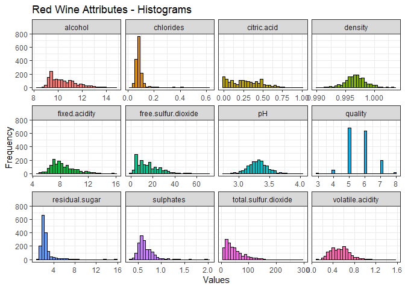
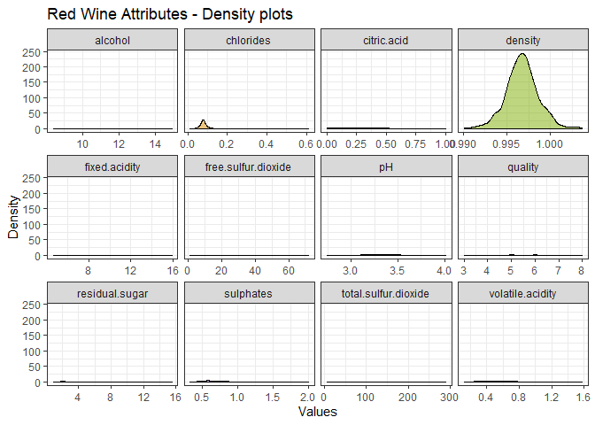
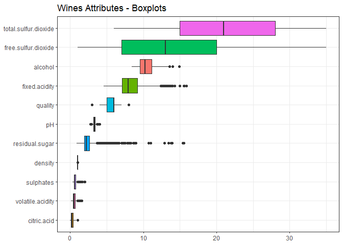
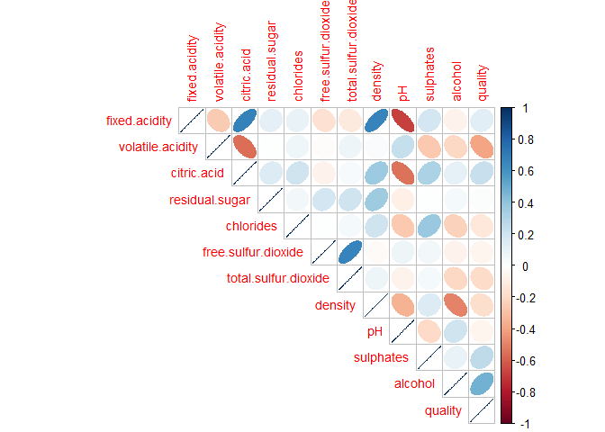
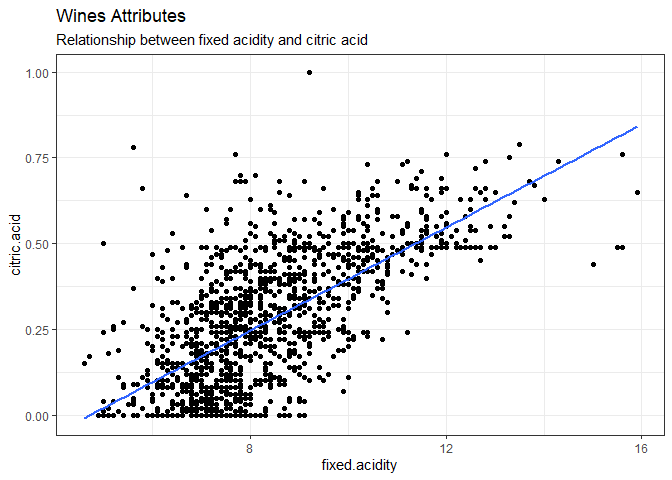
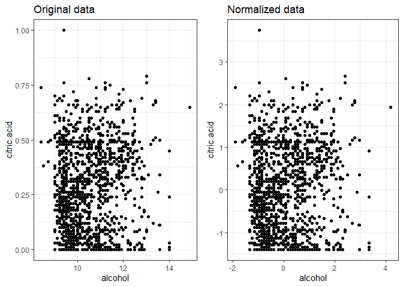
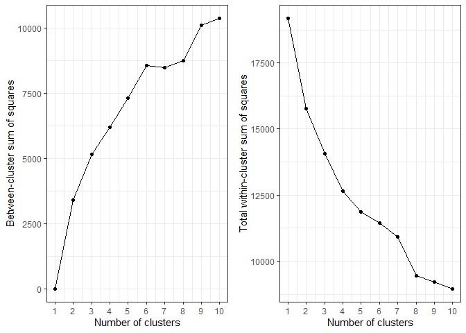
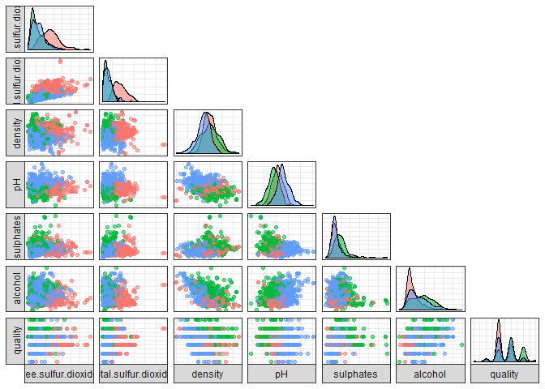

K means
================

Which chemical properties influence the quality of red wines

Data

``` r
# Read the stats
wines <- read.csv("wineQualityReds.csv")
wines <- wines[,2:13]
kable(head(wines))
```

| fixed.acidity | volatile.acidity | citric.acid | residual.sugar | chlorides | free.sulfur.dioxide | total.sulfur.dioxide | density |   pH | sulphates | alcohol | quality |
| ------------: | ---------------: | ----------: | -------------: | --------: | ------------------: | -------------------: | ------: | ---: | --------: | ------: | ------: |
|           7.4 |             0.70 |        0.00 |            1.9 |     0.076 |                  11 |                   34 |  0.9978 | 3.51 |      0.56 |     9.4 |       5 |
|           7.8 |             0.88 |        0.00 |            2.6 |     0.098 |                  25 |                   67 |  0.9968 | 3.20 |      0.68 |     9.8 |       5 |
|           7.8 |             0.76 |        0.04 |            2.3 |     0.092 |                  15 |                   54 |  0.9970 | 3.26 |      0.65 |     9.8 |       5 |
|          11.2 |             0.28 |        0.56 |            1.9 |     0.075 |                  17 |                   60 |  0.9980 | 3.16 |      0.58 |     9.8 |       6 |
|           7.4 |             0.70 |        0.00 |            1.9 |     0.076 |                  11 |                   34 |  0.9978 | 3.51 |      0.56 |     9.4 |       5 |
|           7.4 |             0.66 |        0.00 |            1.8 |     0.075 |                  13 |                   40 |  0.9978 | 3.51 |      0.56 |     9.4 |       5 |

``` r
# Histogram for each Attribute
wines %>%
  gather(Attributes, value) %>%
  ggplot(aes(x=value, fill=Attributes)) +
  geom_histogram(colour="black", show.legend=FALSE) +
  facet_wrap(~Attributes, scales="free_x") +
  labs(x="Values", y="Frequency",
       title="Red Wine Attributes - Histograms") +
  theme_bw()
```

    ## `stat_bin()` using `bins = 30`. Pick better value with `binwidth`.

<!-- -->

``` r
# Density plot for each Attribute
wines %>%
  gather(Attributes, value) %>%
  ggplot(aes(x=value, fill=Attributes)) +
  geom_density(colour="black", alpha=0.5, show.legend=FALSE) +
  facet_wrap(~Attributes, scales="free_x") +
  labs(x="Values", y="Density",
       title="Red Wine Attributes - Density plots") +
  theme_bw()
```

<!-- -->

``` r
# Boxplot for each Attribute  
wines %>%
  gather(Attributes, values, c(1:4, 6:12)) %>%
  ggplot(aes(x=reorder(Attributes, values, FUN=median), y=values, fill=Attributes)) +
  geom_boxplot(show.legend=FALSE) +
  labs(title="Wines Attributes - Boxplots") +
  theme_bw() +
  theme(axis.title.y=element_blank(),
        axis.title.x=element_blank()) +
  ylim(0, 35) +
  coord_flip()
```

    ## Warning: Removed 920 rows containing non-finite values (stat_boxplot).

<!-- -->

``` r
# Correlation matrix 
corrplot(cor(wines), type="upper", method="ellipse", tl.cex=0.9)
```

<!-- -->

``` r
# Relationship between fixed.acidity and citric.acid
ggplot(wines, aes(x=fixed.acidity, y=citric.acid)) +
  geom_point() +
  geom_smooth(method="lm", se=FALSE) +
  labs(title="Wines Attributes",
       subtitle="Relationship between fixed acidity and citric acid") +
  theme_bw()
```

<!-- -->

``` r
# Normalization
winesNorm <- as.data.frame(scale(wines))

# Original data
p1 <- ggplot(wines, aes(x=alcohol, y=citric.acid)) +
  geom_point() +
  labs(title="Original data") +
  theme_bw()

# Normalized data 
p2 <- ggplot(winesNorm, aes(x=alcohol, y=citric.acid)) +
  geom_point() +
  labs(title="Normalized data") +
  theme_bw()

# Subplot
grid.arrange(p1, p2, ncol=2)
```

<!-- -->

``` r
# Execution of k-means with k=2
set.seed(1234)
wines_k2 <- kmeans(winesNorm, centers=2)
wines_k2$cluster
```

    ##    [1] 1 1 1 2 1 1 1 1 1 1 1 1 1 2 1 1 2 2 1 2 2 1 2 1 1 1 1 2 1 1 1 1 1 1
    ##   [35] 1 1 1 2 1 1 1 1 2 1 1 1 1 2 1 1 1 1 1 1 1 1 2 1 1 1 1 1 1 1 1 1 1 1
    ##   [69] 2 1 1 1 1 1 2 2 2 1 1 1 1 2 1 2 1 1 2 1 2 1 1 2 2 1 1 1 1 1 1 1 1 1
    ##  [103] 1 1 1 1 2 1 2 1 1 1 1 2 1 2 1 1 1 1 1 1 1 1 1 1 1 1 1 1 1 1 1 1 1 1
    ##  [137] 1 1 1 1 1 1 1 1 1 1 1 2 1 1 2 2 1 1 1 1 1 1 1 1 1 1 1 1 1 1 1 1 1 2
    ##  [171] 1 1 1 1 1 1 1 1 1 1 1 2 1 1 1 2 1 1 1 1 1 1 1 1 1 1 1 2 1 1 2 2 1 1
    ##  [205] 1 2 2 1 1 2 2 1 2 1 1 1 1 1 1 1 1 1 1 1 1 1 2 1 1 1 1 1 1 1 1 1 1 1
    ##  [239] 1 1 2 2 1 2 2 1 1 1 1 1 2 1 2 1 1 1 2 1 2 2 1 1 1 1 2 2 1 2 1 2 1 2
    ##  [273] 2 1 1 1 1 2 2 2 2 2 1 2 1 1 2 1 2 2 2 2 2 1 2 2 1 1 1 1 1 2 1 1 1 2
    ##  [307] 1 2 2 1 2 1 1 1 1 1 1 1 2 1 2 1 1 2 2 2 2 2 2 2 2 2 1 1 1 2 2 1 2 2
    ##  [341] 2 2 2 2 2 1 1 2 2 1 2 1 1 2 1 1 2 2 2 2 1 2 2 2 2 2 2 2 2 2 1 2 2 1
    ##  [375] 2 2 2 2 2 2 2 2 2 2 1 1 1 1 1 2 1 2 2 1 2 2 1 2 2 1 1 1 2 2 1 2 2 2
    ##  [409] 2 2 1 1 1 2 1 1 2 1 2 1 2 1 1 2 1 1 1 1 1 2 2 1 2 2 2 2 1 2 2 1 2 2
    ##  [443] 2 2 1 1 2 2 1 2 2 2 1 2 1 2 1 1 2 2 2 1 2 1 2 2 2 2 2 1 2 2 2 2 2 1
    ##  [477] 2 2 1 1 2 2 2 2 2 2 2 2 2 2 1 2 2 1 1 2 1 1 2 1 1 2 2 2 2 2 2 2 2 2
    ##  [511] 2 2 2 2 2 2 2 2 2 1 2 1 2 1 2 1 1 2 2 1 2 2 2 2 2 2 1 1 2 2 1 2 1 2
    ##  [545] 2 2 1 2 2 2 1 2 2 1 2 2 2 2 2 2 2 1 2 2 2 2 1 1 2 1 2 1 2 2 2 2 1 1
    ##  [579] 1 2 2 2 2 2 2 1 2 1 1 2 2 1 2 2 1 1 2 2 1 2 1 2 1 2 1 1 2 2 2 1 2 2
    ##  [613] 1 2 2 1 1 2 2 2 1 1 1 1 1 1 1 1 1 1 1 2 1 1 1 1 1 1 1 2 2 1 2 1 2 1
    ##  [647] 1 1 2 1 2 1 2 2 2 1 2 2 1 1 1 1 1 2 2 1 2 2 2 2 1 1 1 1 2 2 2 1 1 2
    ##  [681] 2 1 1 1 1 1 1 1 1 2 1 1 2 1 1 1 1 1 1 2 1 1 1 1 1 1 1 1 1 2 1 1 1 1
    ##  [715] 1 1 1 1 1 1 1 1 1 2 1 1 1 1 1 1 2 1 1 1 1 1 1 1 1 1 1 1 1 2 2 1 1 1
    ##  [749] 1 1 1 1 1 1 2 1 1 1 1 1 1 1 1 1 1 1 1 1 1 1 1 1 1 2 2 1 1 1 1 1 1 1
    ##  [783] 1 1 1 2 2 2 2 1 1 1 1 1 2 2 2 2 2 2 1 1 1 1 1 2 2 2 1 1 1 2 2 1 2 2
    ##  [817] 2 2 1 1 1 1 1 1 1 1 2 1 1 1 1 1 2 2 1 1 1 1 2 1 2 1 2 1 2 1 1 1 1 1
    ##  [851] 2 2 2 2 2 1 2 2 2 1 1 1 1 1 1 1 1 1 1 1 1 1 1 2 2 2 1 1 1 1 1 1 2 1
    ##  [885] 1 1 1 2 1 2 1 1 2 1 1 1 2 1 2 1 2 1 1 1 1 1 1 1 1 1 2 2 2 2 1 2 1 1
    ##  [919] 2 1 2 2 1 1 2 2 2 1 2 2 1 1 1 1 1 2 2 2 2 1 2 2 2 2 2 2 2 2 2 2 2 2
    ##  [953] 2 2 1 2 2 2 1 1 2 1 1 2 2 2 2 1 2 1 2 2 2 1 2 1 1 1 1 2 2 1 1 2 2 1
    ##  [987] 2 1 1 2 1 1 1 1 2 1 1 1 1 1 1 2 2 1 1 1 2 2 2 2 2 2 1 1 1 2 2 2 2 1
    ## [1021] 2 2 1 2 1 1 1 1 1 1 1 1 1 1 1 2 2 1 2 2 1 1 2 2 1 1 1 1 2 2 1 2 1 2
    ## [1055] 1 1 2 1 2 2 2 2 2 2 1 1 1 2 2 1 2 1 1 1 1 2 2 2 2 2 2 2 1 2 1 1 2 2
    ## [1089] 2 2 2 2 1 2 1 2 1 1 2 1 2 1 1 1 1 1 2 2 1 2 1 1 2 2 1 1 1 1 1 1 2 1
    ## [1123] 1 2 1 2 1 1 2 2 1 1 2 1 2 2 2 2 1 1 1 2 1 1 1 2 1 2 2 2 2 1 1 2 1 1
    ## [1157] 2 1 2 2 2 2 2 1 1 2 2 2 1 1 2 1 2 1 1 1 1 1 1 2 2 2 2 1 1 1 1 1 1 1
    ## [1191] 2 1 2 1 1 1 1 1 2 1 1 2 2 1 2 2 2 2 2 2 1 1 1 2 2 2 1 2 2 2 2 2 1 2
    ## [1225] 2 1 1 1 1 1 2 1 1 2 1 1 1 1 1 1 1 2 2 1 1 1 1 1 1 1 1 1 1 1 1 1 1 1
    ## [1259] 1 1 2 1 2 1 1 1 1 2 1 1 1 1 1 1 1 1 2 1 1 2 1 1 1 1 1 2 2 1 1 1 1 1
    ## [1293] 1 1 1 1 1 1 1 1 1 1 2 1 1 1 1 1 1 1 1 1 1 1 1 1 1 2 1 2 1 1 2 2 1 1
    ## [1327] 1 1 1 1 1 1 1 1 1 1 1 1 1 1 1 1 1 1 2 1 1 1 1 1 1 1 1 1 1 1 1 1 1 2
    ## [1361] 1 1 2 1 1 1 1 2 1 1 2 2 2 1 1 1 1 1 1 1 1 1 1 1 1 1 1 1 1 1 1 1 1 1
    ## [1395] 1 1 1 1 1 1 1 1 2 2 1 2 2 1 2 1 1 1 2 2 2 1 2 2 1 1 1 1 1 1 2 2 2 1
    ## [1429] 1 2 1 1 1 1 2 2 2 1 1 1 2 1 1 1 1 1 1 1 1 2 2 2 1 1 2 1 1 1 2 2 1 1
    ## [1463] 1 1 1 1 1 1 1 1 1 1 2 1 2 1 2 1 1 2 1 2 1 1 1 1 1 1 1 1 2 1 1 1 1 1
    ## [1497] 1 1 1 1 1 1 1 1 2 1 1 2 2 2 1 1 1 1 1 1 1 1 1 1 1 1 1 1 1 1 1 1 2 1
    ## [1531] 1 1 1 1 1 1 1 1 1 1 1 2 1 2 2 1 1 1 2 2 1 1 1 1 1 1 1 1 1 1 1 1 1 1
    ## [1565] 1 1 2 1 1 1 2 1 1 1 2 1 2 1 1 1 1 1 1 1 2 2 2 1 1 1 1 1 1 1 1 1 1 1
    ## [1599] 1

``` r
# Cluster centers
wines_k2$centers
```

    ##   fixed.acidity volatile.acidity citric.acid residual.sugar  chlorides
    ## 1    -0.5110885        0.4208925  -0.5706485    -0.07260346 -0.1340215
    ## 2     0.8858867       -0.7295470   0.9891242     0.12584600  0.2323040
    ##   free.sulfur.dioxide total.sulfur.dioxide    density         pH
    ## 1           0.1027501            0.1435627 -0.2251450  0.3888984
    ## 2          -0.1781002           -0.2488421  0.3902513 -0.6740906
    ##    sulphates    alcohol    quality
    ## 1 -0.3284437 -0.1675215 -0.2697930
    ## 2  0.5693024  0.2903706  0.4676411

``` r
# Between-cluster sum of squares
wines_k2$betweenss
```

    ## [1] 3406.468

``` r
# Within-cluster sum of squares
wines_k2$withinss
```

    ## [1] 8334.629 7434.904

``` r
# Total within-cluster sum of squares 
wines_k2$tot.withinss
```

    ## [1] 15769.53

``` r
# Total sum of squares
wines_k2$totss
```

    ## [1] 19176

``` r
bss <- numeric()
wss <- numeric()

# Run the algorithm for different values of k 
set.seed(1234)

for(i in 1:10){
  
  # For each k, calculate betweenss and tot.withinss
  bss[i] <- kmeans(winesNorm, centers=i)$betweenss
  wss[i] <- kmeans(winesNorm, centers=i)$tot.withinss
  
}

# Between-cluster sum of squares vs Choice of k
p3 <- qplot(1:10, bss, geom=c("point", "line"), 
            xlab="Number of clusters", ylab="Between-cluster sum of squares") +
  scale_x_continuous(breaks=seq(0, 10, 1)) +
  theme_bw()

# Total within-cluster sum of squares vs Choice of k
p4 <- qplot(1:10, wss, geom=c("point", "line"),
            xlab="Number of clusters", ylab="Total within-cluster sum of squares") +
  scale_x_continuous(breaks=seq(0, 10, 1)) +
  theme_bw()
```

``` r
# Subplot
grid.arrange(p3, p4, ncol=2)
```

<!-- -->

We choose k=3

``` r
# Execution of k-means with k=3
set.seed(1234)

wines_k3 <- kmeans(winesNorm, centers=3)

# Mean values of each cluster
aggregate(wines, by=list(wines_k3$cluster), mean)
```

    ##   Group.1 fixed.acidity volatile.acidity citric.acid residual.sugar
    ## 1       1      8.223057        0.5367098   0.2923834       3.064896
    ## 2       2      9.969763        0.3972332   0.4670356       2.591008
    ## 3       3      7.191372        0.6164286   0.1189675       2.214215
    ##    chlorides free.sulfur.dioxide total.sulfur.dioxide   density       pH
    ## 1 0.08761658            26.49352             88.56477 0.9973327 3.283731
    ## 2 0.09881818            11.40119             31.19170 0.9974330 3.198794
    ## 3 0.07926025            13.27935             34.41726 0.9959355 3.406450
    ##   sulphates   alcohol  quality
    ## 1 0.6258290  9.828843 5.277202
    ## 2 0.7576877 10.829578 6.090909
    ## 3 0.6045545 10.456365 5.506365

``` r
ggpairs(cbind(wines, Cluster=as.factor(wines_k3$cluster)),
        columns=6:12, aes(colour=Cluster, alpha=0.5),
        lower=list(continuous="points"),
        upper=list(continuous="blank"),
        axisLabels="none", switch="both") +
  theme_bw()
```

<!-- -->
